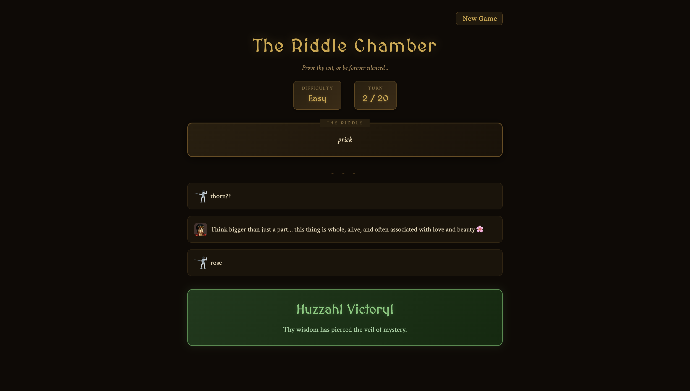

# Riddle Game

An AI-powered riddle guessing game where you try to solve riddles while an AI riddle master gives you vague hints. Built with Streamlit and Claude.

## Screenshots



## How It Works

1. A random riddle is selected based on difficulty and category
2. You get up to 20 turns to guess the answer
3. After each incorrect guess, the AI provides a vague hint to nudge you in the right direction

## Setup

### Prerequisites

- Python 3.10+
- An [Anthropic API key](https://console.anthropic.com/)

### Installation

1. Clone the repository:
   ```bash
   git clone <repo-url>
   ```

2. Install dependencies:
   ```bash
   pip install -r requirements.txt
   ```

3. Create a `.env` file from the template and add your API key:
   ```bash
   cp .env.template .env
   ```
   Then set your `ANTHROPIC_API_KEY` in the `.env` file.

### Running the Game

```bash
streamlit run riddle_launcher.py
```

## Tech Stack

- **Frontend**: Streamlit
- **LLM**: Claude (via LangChain)

## Credits

- [Craftpix.net](https://craftpix.net) for providing beautiful NPC avatars
